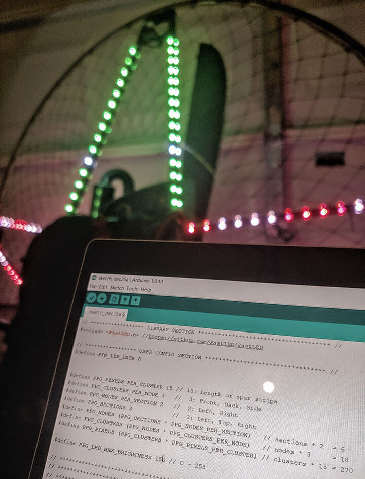
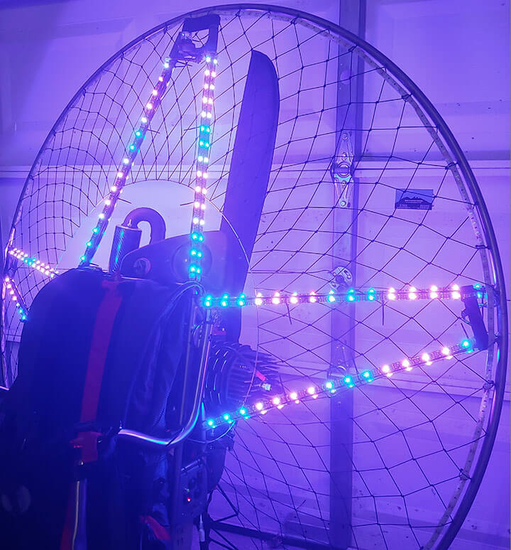
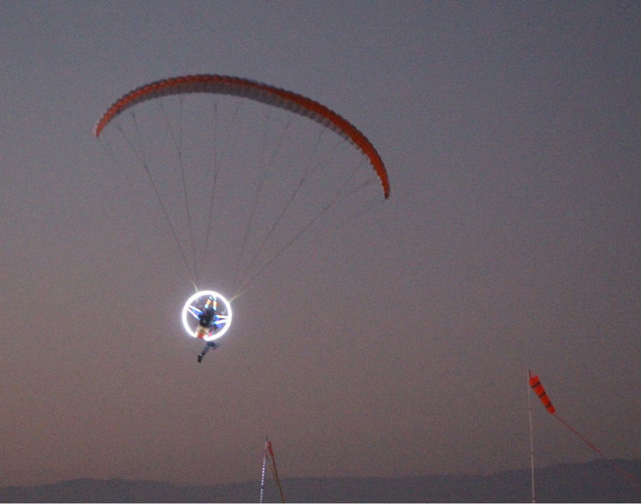
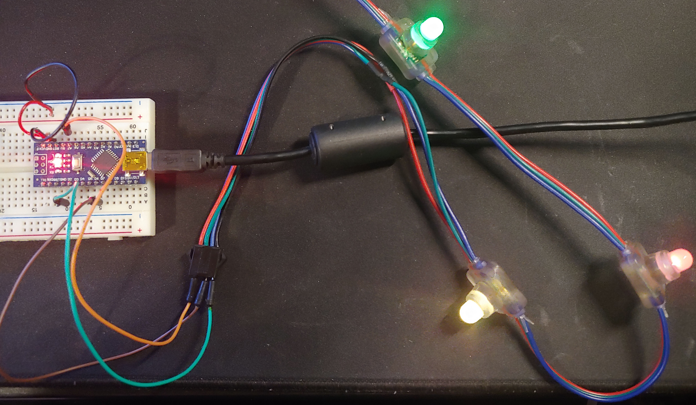
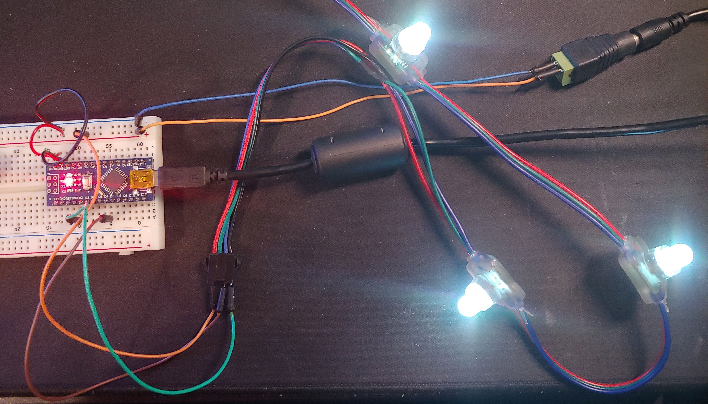
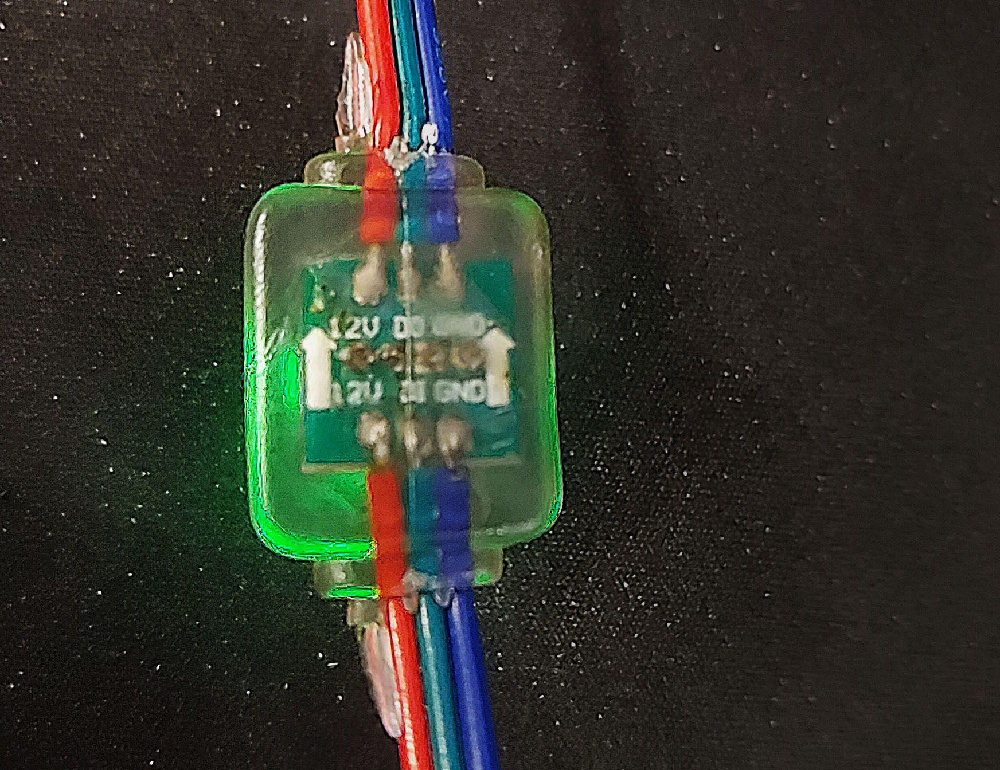
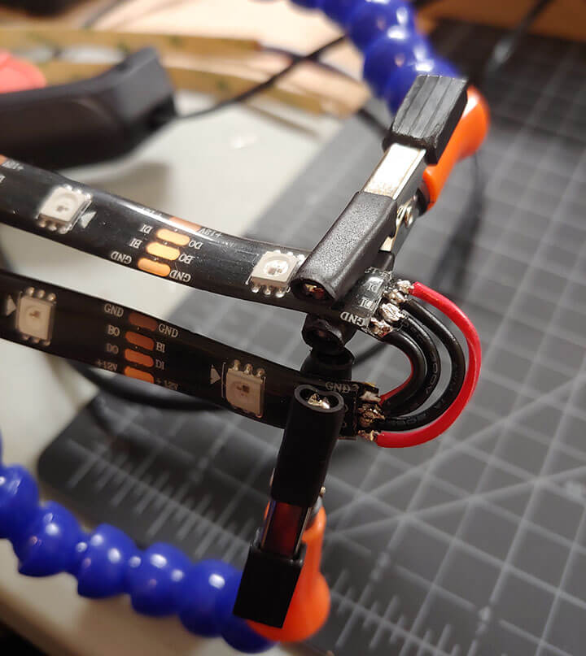
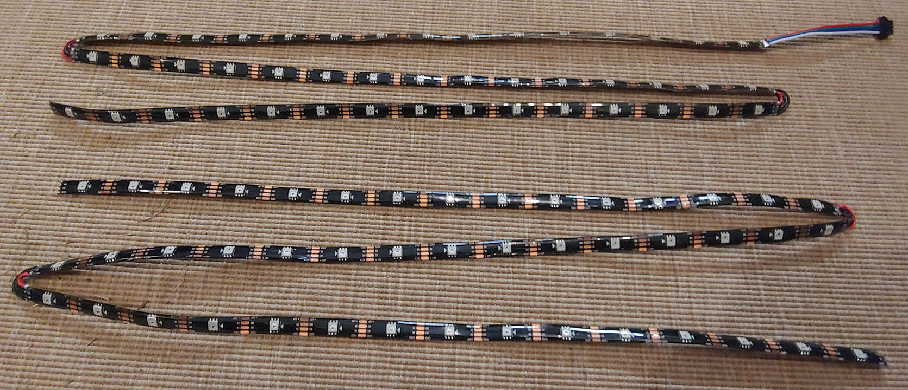
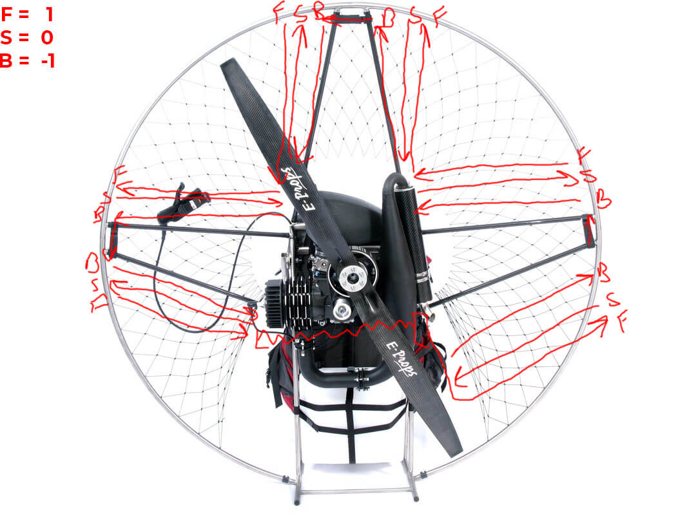

# Arduino LED Control
Arduino code for controlling LEDs:  
See working [animation code on a Paramotor Frame](https://youtu.be/QCYgQ3sWGrA) (youtube video)

---------------------------------------
# How to Program the Arduino Boards
## Prerequisites
* Install [Arduino IDE](https://www.arduino.cc/en/software)
* Open the IDE then click `Tools` -> `Manage Libraries...` -> Search for and install `FastLED` by Daniel Garcia

## With [Arduino IDE](https://www.arduino.cc/en/software)
Make sure you can upload code in Arduino IDE first
* Open the IDE then click `File` -> `Open...` (Browse to the [arduino-led.ino](./arduino-led.ino))
* Connect your arduino via USB
* `Tools` -> `Board` -> (Choose your board, this was coded for the `Arduino Nano`)
* `Tools` -> `Programmer` -> Choose `AVRISP mkII` for the Nano
* `Tools` -> `Port` -> (Chose the COM port of the arduino)
* CLick the Upload `->` Icon (Top left corner) to upload the code to the Arduino Board.

## With [VSCode](https://code.visualstudio.com/)
VSCode is more friendly to code in, so after setting up Arduino IDE you can switch over.
* Open VSCode then click `File` -> `Open Folder...` (Browse to this top level folder))
* Install the workspace recommended extensions (VSCode should ask). They are defined [here](./.vscode/extensions.json) for reference
* Connect your arduino via USB
* Change the paths in [c_cpp_properties.json](./.vscode/c_cpp_properties.json) appropriate for your system.
* If needed change values in [arduino.json](./.vscode/arduino.json). Extension will also display the Port, Programmer and Board at the bottom of the screen to switch between.
* Open [arduino-led.ino](./arduino-led.ino)
* Click the Upload Icon (Top right corner) to upload the code to the Arduino Board.

## Changing Colors/Patterns/Code
* Everything is done in [arduino-led.ino](./arduino-led/arduino-led.ino)
* Specific LED strip presets can be imported, or not and used the default #defines for LED setup
* Color/Patters preset selections follow after
* General code is the rest
* Add new bi-colors in the `getBiColor()` function
* Add new animations to the `activateLeds()` function

# Hardware/Build
* LED Lights 2x: [ws2815](https://www.amazon.com/gp/product/B07SFTK99V/)
* Controller: [Arduino Nano v3 ATmega328P](https://www.amazon.com/gp/product/B0713XK923/)
* Battery: [12V 6000mAh](https://www.amazon.com/dp/B00ME3ZH7C/)
* More gear linked on [my website](https://deniszholob.com/ppg)

## Soldering
LED strips had 4 connections:

| Strip Connection | Arduino Pin |
| ---------------- | ----------- |
| Ground | GND (Shared) |
| 12v | VIN (Shared) |
| Data | D6 (Output) |
| Data Backup | D6 (Output) |

## Simple LED Test
5 Volt Board power: 
12 Volt External Power 
Test LED (TM1809 chipset) Connection 

## Paramotor Strips

## PPG AC Nitro200 Wiring
Global LED array => 270 total  
Purchased 2 rolls, 150 per led roll = 300 total => 30 left over

* 3 sections
  * Left
  * Top
  * Right
* 2 clusters per section
  * Left
  * Right
* 3 Nodes per cluster
  * Front
  * Back
  * Side
* 15 leds per node

Air Conception Paramotor LED Wiring

# Resources
## Arduino
* https://www.arduino.cc/reference/en/language/structure/pointer-access-operators/dereference/
* https://learn.sparkfun.com/tutorials/data-types-in-arduino/all
* https://www.tutorialspoint.com/cplusplus/cpp_data_structures.htm
* https://www.cprogramming.com/c++11/c++11-lambda-closures.html
* https://stackoverflow.com/questions/28746744/passing-capturing-lambda-as-function-pointer
* https://learn.adafruit.com/multi-tasking-the-arduino-part-1/using-millis-for-timing
* https://forum.arduino.cc/index.php?topic=580012.0
* https://www.arduino.cc/en/Tutorial/StateChangeDetection
* https://forum.arduino.cc/index.php?topic=426632.0
* https://learn.sparkfun.com/tutorials/pull-up-resistors/all
* https://www.arduino.cc/en/tutorial/pushbutton
* http://ediy.com.my/index.php/tutorials/item/95-arduino-function-with-optional-arguments

## FastLED
* https://github.com/FastLED/FastLED
* https://github.com/FastLED/FastLED/wiki/Overview
* https://github.com/FastLED/FastLED/wiki/Controlling-leds
* http://fastled.io/docs/3.1/group___colorutils.html#ga3144bb2bb66aeed33e20f4fdd6cc1a98

## Code Ref
* https://www.youtube.com/results?search_query=FastLED+programming+patterns+tutorial
* https://www.youtube.com/watch?v=EcMKditEVtY
* http://hamburgtech.de/downloads/
* https://github.com/thehookup/Holiday_LEDs_2.0/blob/master/Holiday_LED_2.0_6_Zones.ino
* https://www.tweaking4all.com/hardware/arduino/adruino-led-strip-effects/#LEDStripEffectMeteorRain
* http://yaab-arduino.blogspot.com/p/ala.html

## Color
* https://sighack.com/post/procedural-color-algorithms-color-variations

## Sim
* https://dougalcampbell.github.io/LEDStrip/
* https://github.com/dougalcampbell/LEDStrip
* https://forum.arduino.cc/index.php?topic=534060.0
